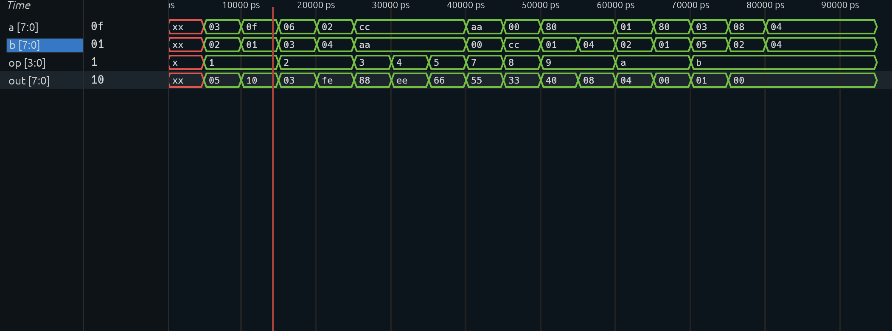

# 8-Bit ALU in Verilog

## Overview

This project implements an 8-bit Arithmetic Logic Unit (ALU) in Verilog and verifies its functionality using a custom testbench and Surfer simulation.

## Features

Supported operations:

| Opcode | Operation |
|----------|----------|
| 0001 | Addition |
| 0010 | Subtraction |
| 0011 | AND |
| 0100 | OR |
| 0101 | XOR |
| 0111 | NOT A |
| 1000 | NOT B |
| 1001 | Shift Right |
| 1010 | Shift Left |
| 1011 | Compare (A < B) |

## Tools Used

- Visual Studio Code
- Extension:	
	- Verilog-HDL/SystemVerilog  
	- surfer

## Simulation Results

Waveform verification:

## Future Improvements

- Carry Flag
- Zero Flag
- Overflow Flag
- Negative Flag

## Author

Nishaanth Sai Vinodh Kumar
